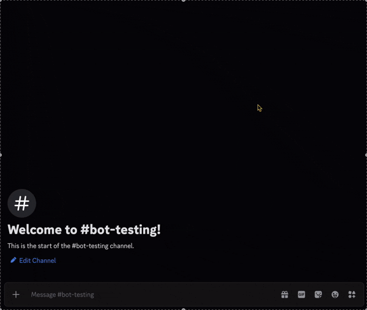

## 🎥 Demo
Here’s a quick look at the bot fetching equipment data in Discord:




# 🛡️ MLBB Equipment Bot  

A **practice project** developed to showcase my skills in **Python**, **JavaScript**, and **Discord bot development**.  
The bot allows *Mobile Legends: Bang Bang (MLBB)* players to retrieve **equipment stats and images** using Discord **slash commands**, powered by data collected through a custom **Python web scraper**.

---

## 🎯 Project Purpose  

This project was created as a **portfolio project** to demonstrate:  
- **Data scraping** from external web sources using Python  
- **Database design and management** in PostgreSQL  
- **Data retrieval and interaction** through a Node.js Discord bot  
- **Integration of multiple technologies** into a single functional workflow  

The end result is a Discord bot that fetches and displays MLBB equipment information — stats, type, effects, and images — directly in chat using rich embeds. .

---

## ⚙️ Key Skills Demonstrated  

### 🐍 Python  
- Developed a **web scraper** using `BeautifulSoup` and `Requests` to extract equipment details (stats, item type, cost, and image).  
- Cleaned and structured the scraped data into **CSV Files** for easy import of data into a **PostgreSQL** database.  
- Practiced automation, data validation, and file organization.

### 💾 PostgreSQL
- Designed relational tables for **equipment metadata and stats**.  
- Used **SQL queries** for CRUD operations (insert, update, fetch).  
- Ensured efficient lookups using **indexes** and normalized schema design.

### 💻 JavaScript / Node.js  
- Implemented **slash commands** (`/<equipment_type> <item_name>`) using `Discord.js v14`.  
- Queried PostgreSQL via the **node-postgres (pg)** library.  
- Used **async/await** to handle data retrieval and embed construction.  
- Displayed information using **rich Discord embeds** with item stats and images. 

### 🧰 Development Practices  
- Managed environment variables with `dotenv`.  
- Used Git and GitHub for version control and documentation.  
- Focused on writing **clean, maintainable, and reusable** code.  

---

## ✨ Features  

✅ **Python Web Scraping** – Collects equipment data automatically.  
✅ **PostgreSQL Integration** – Stores structured, queryable data.  
✅ **Slash Command Interface** – Modern `/commands` for user interaction.  
✅ **Dynamic Embeds** – Displays real-time data from the database.  
✅ **Full-Stack Workflow** – End-to-end data handling from collection to presentation.  
  

---

## 🧠 Tech Stack  

| Category | Tools / Technologies |
|-----------|----------------------|
| **Languages** | Python, JavaScript (ES6) |
| **Libraries** | BeautifulSoup, Requests, Discord.js, node-postgres |
| **Runtime / Framework** | Node.js |
| **Tools** | Git, VS Code, dotenv |
| **Data Format** | JSON, SQL |

---

## 📂 Folder Structure  

``` bash
MLBB-Equipment-Bot/
│
├── Python/ # Python web scraping scripts
│ ├── scrape.py #Script to scrape the data
│ ├── importToDB.py # Inserts scraped data into PostgreSQL
│ ├── table_for_stats.py # Creates .csv files for just the numeric values (Not used)
│ ├── ML_equip.HTML # HTML file of the static website where the data was scraped
│ └── requirements.txt # List of all the dependencies for python
│
├── nodejs/ # Node.js bot source code
│ ├── src
│   ├── index.js # Main file that runs the bot
│   ├── require-commands.js # Script to register the slash commands to the bot
│   ├── functions
│     ├── cache.js # caches the data if the same table is called to reduce calls made to the db
│     └── table_data.js # Functions to extracts the data from the different tables
│   ├── slash_commands
│     └── slash_command_creator.js # Creates slash commands for discord.js
│ ├── package-lock.json # Dependencies for node
│ └── HOK_equip.js # Script to extract and download the HTML file
│ 
```
## 📜 Note  

- This is a **practice and portfolio project**, not affiliated with *Mobile Legends: Bang Bang* or Moonton.  It was built to demonstrate my ability to connect **data engineering, database design, and application logic** into one cohesive system.
- Data was scraped from [MLBB meta](https://mlbbmeta.com/items/). Since its a static site the HTML was first downloaded and then scraped offline


---
## 👨‍💻 Author  

**DRted**  
> A full-stack practice project showcasing web scraping, database integration, and Discord bot development.  

🔗 [GitHub Repository](https://github.com/DRted2099/MLBB-Equipment-Bot/tree/main)

